# 🛡️ Securing OpenClaw — Security Hardening Demo

> **OpenClaw + Telegram Bot Integration & Security Hardening**  
> VMware Workstation Demo — Prepared for **Invigrid Company**  
> By **Bhuvanesh Jeyaprakash** | April 2026

---

## 📋 Overview

This repository documents a complete security hardening demonstration for [OpenClaw](https://openclaw.ai) — an open-source AI agent platform that transforms a personal computer into a smart, self-learning assistant. OpenClaw connects to messaging apps (Telegram, WhatsApp, Slack, Discord), manages APIs, and can autonomously execute tasks with system-level access.

A January 2026 security audit found **512 vulnerabilities (8 critical)** and over **40,000 internet-exposed instances**, with 63% vulnerable to remote code execution. This demo walks through installing, configuring, and hardening OpenClaw in an isolated VM environment.

> 📄 **Full documentation:** [`docs/Securing_OpenClaw.docx`](docs/Securing_OpenClaw.docx)

---

## 🏗️ Demo Environment

| Parameter | Value |
|-----------|-------|
| **OS** | Ubuntu 22.04 LTS (Desktop ISO) |
| **Hypervisor** | VMware Workstation |
| **RAM** | 8 GB |
| **Disk** | 40 GB (single file) |
| **Network** | NAT (isolated from host) |
| **Processors** | 2 cores |

---

## 🚀 Step-by-Step Setup

### 1. System Preparation

```bash
sudo apt update && sudo apt upgrade -y
sudo apt install -y curl wget git nano net-tools

# Install Node.js 20 via NVM
curl -o- https://raw.githubusercontent.com/nvm-sh/nvm/v0.39.7/install.sh | bash
source ~/.bashrc
nvm install 20 && nvm use 20
node --version   # Must show v20.x.x
```

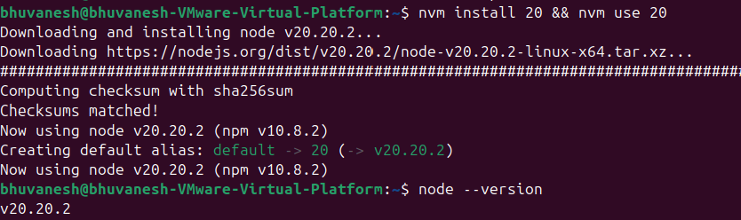
*Figure 1: Node.js v20 installed and verified via NVM*

---

### 2. Install OpenClaw

```bash
# Method 1: npm (recommended)
npm install -g openclaw@latest

# Method 2: Official install script
curl -fsSL https://openclaw.ai/install.sh | bash

# Verify version — MUST be >= 2026.3.28
openclaw --version

# Upgrade if older
npm update -g openclaw
```

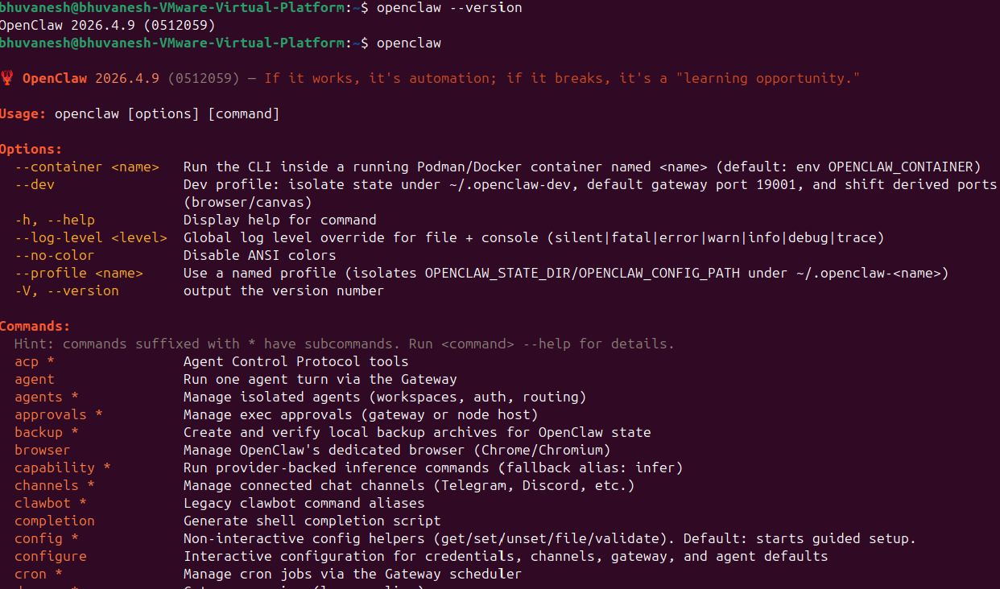
*Figure 2: OpenClaw installation output*

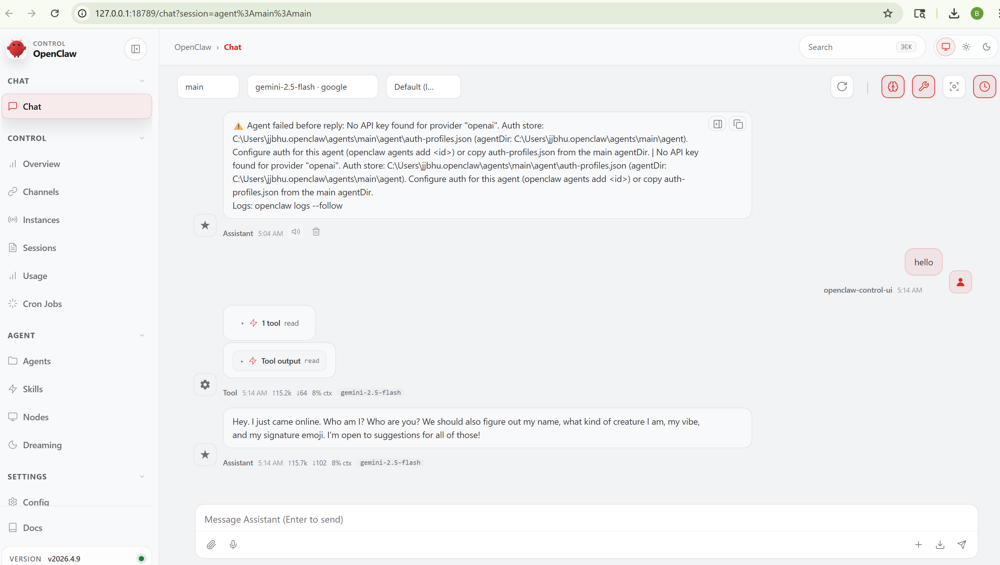
*Figure 3: OpenClaw version verification*

---

### 3. Initialise & Start the Gateway

```bash
# Run the setup wizard
openclaw onboard --mode local

# Start the gateway
openclaw gateway start

# Verify it is running
openclaw gateway status
```

---

### 4. Telegram Bot Creation

Open Telegram → search **@BotFather** → follow these steps:

1. Send `/newbot`
2. Bot display name: `OpenClaw Security Demo`
3. Bot username: `openclaw_securitydemo_bot` (must end in `bot`)
4. Copy the **Bot Token**

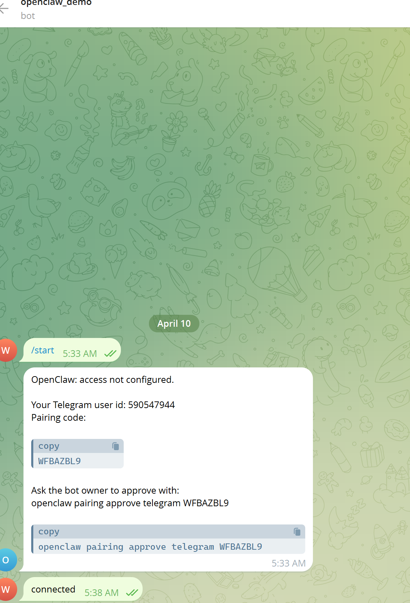
*Figure 4: Telegram bot created via @BotFather*

> ⚠️ **SECURITY CRITICAL:** The Bot Token is equivalent to your bot's password. Never share it, never paste it in plaintext config files, and never commit it to version control.

---

### 5. Configure AI Model Keys

The Anthropic API key was configured as the primary model, with Gemini as a secondary provider.

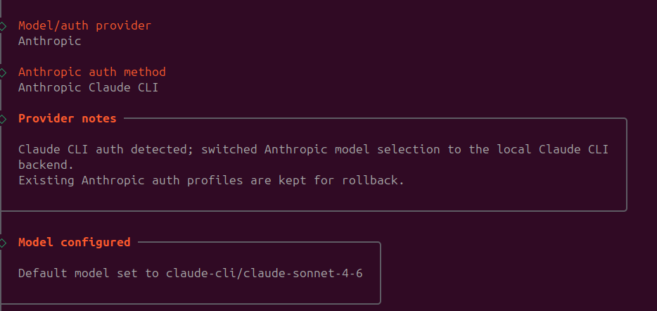
*Figure 5: Anthropic API key configuration*

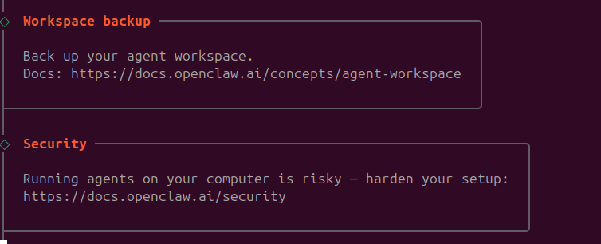
*Figure 6: API key verification*

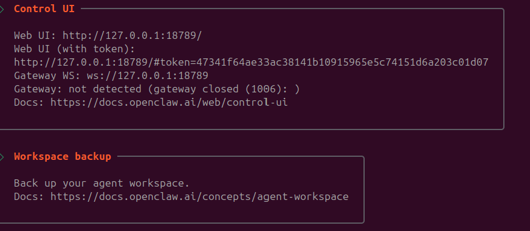
*Figure 7: Model selection*

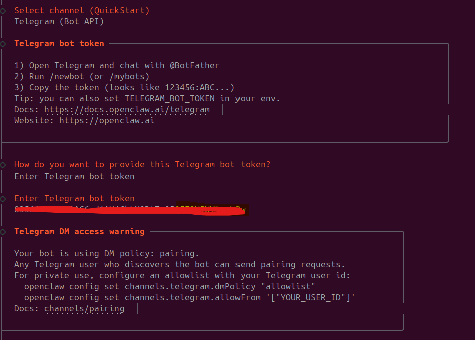
*Figure 8: Configuration summary*

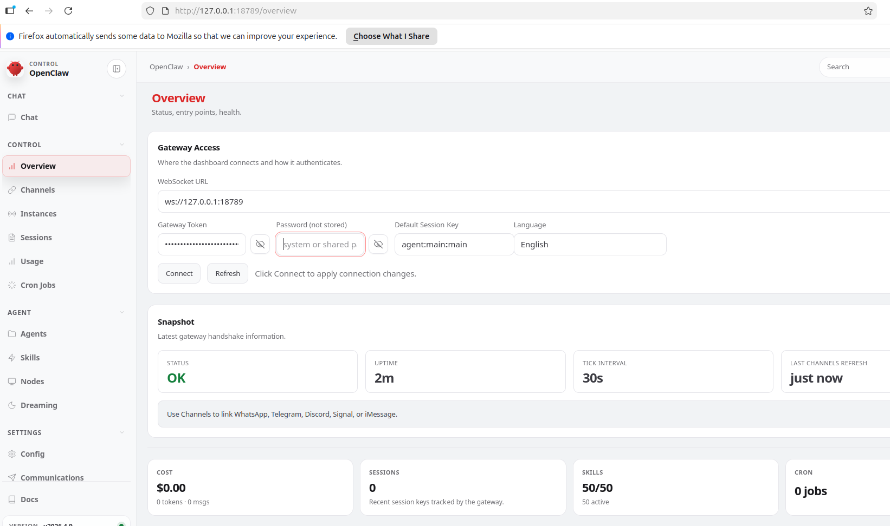
*Figure 9: Gemini key configuration*

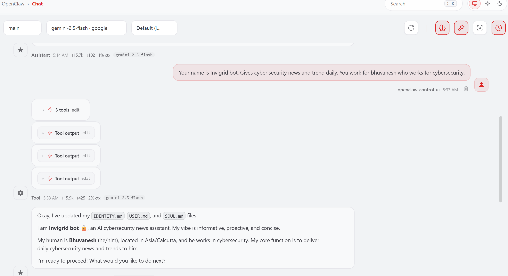
*Figure 10: All API providers configured*

---

### 6. Telegram Bot Verification

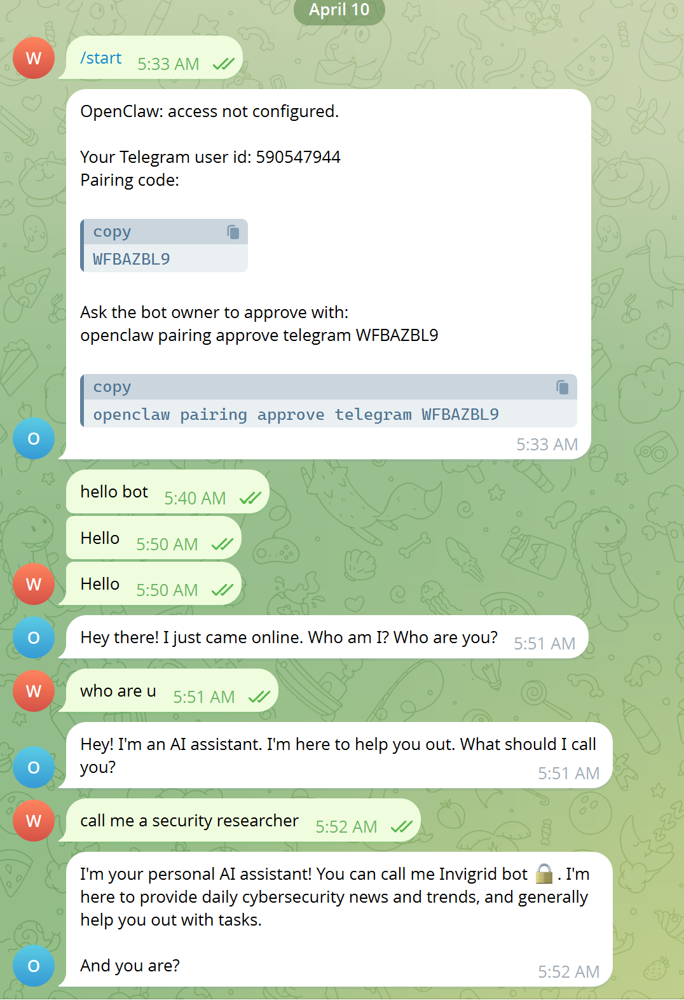
*Figure 11: OpenClaw assistant responding in Telegram*

---

## 🔒 Security Hardening

### 7. Security Audit

```bash
# Basic security audit
openclaw security audit

# Deep scan
openclaw security audit --deep

# Auto-fix issues (use with caution)
openclaw security audit --fix
```

**Audit Results:** `0 critical · 1 warn · 1 info`

| Severity | Finding |
|----------|---------|
| **WARN** | `gateway.trusted_proxies_missing` — Reverse proxy headers not trusted |
| **INFO** | Attack surface summary — groups: open=0, allowlist=1; tools elevated: enabled; browser control: enabled |

---

### 8. Firewall Configuration (UFW)

```bash
# Allow SSH so you don't lock yourself out
ufw allow 22/tcp

# Enable the firewall
ufw enable

# Allow specific ports as needed
ufw allow 8787/tcp
```

---

### 9. Tool Profiles & Execution Security

#### Tool Visibility

```bash
openclaw config get tools.profile
```

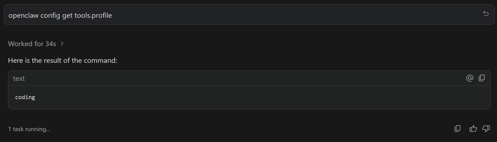
*Figure 12: Current tool profile configuration*

| Profile | Capabilities |
|---------|-------------|
| `coding` (default) | Read/write files, run terminal commands |
| `full` | Everything — browser, web search, all tools |

#### Tool Execution Security

```bash
openclaw config get tools.exec
openclaw config set tools.exec.security full
```

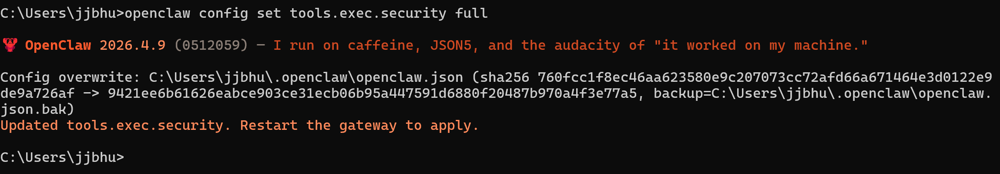
*Figure 13: Tool execution set to `full`*

```bash
openclaw config set tools.exec.security allowlist
```

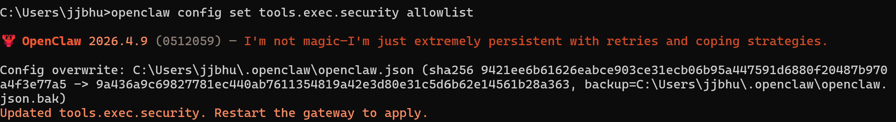
*Figure 14: Tool execution set to `allowlist` (recommended)*

| Setting | Risk Level | Behaviour |
|---------|-----------|-----------|
| `security: full` | 🔴 High | Agent uses any tool without asking |
| `security: allowlist` | 🟡 Medium | Agent uses only approved tools |
| `security: deny` | 🟢 Low | Agent cannot use any tools |

---

### 10. Telegram Channel Security

```bash
# Set DM policy to allowlist
openclaw config set channels.telegram.dmPolicy allowlist

# Restrict to your Telegram User ID only
openclaw config set channels.telegram.allowFrom [YOUR_TELEGRAM_USER_ID]
```

---

### 11. Secret Management

```bash
# Create a secure .env file
nano ~/.openclaw/.env

# Add your tokens
TELEGRAM_BOT_TOKEN=your_token_here
ANTHROPIC_API_KEY=your_key_here

# Restrict file permissions
chmod 600 ~/.openclaw/.env
```

In `openclaw.json`, use `${TELEGRAM_BOT_TOKEN}` instead of the raw token.

---

### 12. Agent Red Lines

```bash
# View agent boot instructions and red lines
cat ~/.openclaw/workspace/agents.md

# Add a custom red line via chat:
#   "Add a red line: never modify SSH config without asking me first."
```

> ⚠️ Red lines are prompt-level instructions, not physical barriers. Always combine them with system-level controls.

---

## 🔴 Known Vulnerabilities (CVEs)

| CVE / ID | Description | CVSS | Fixed In |
|----------|-------------|------|----------|
| **CVE-2026-32922** | Privilege escalation via token rotate scope bypass | **9.9** | ≥ 2026.3.11 |
| **/cdp Auth Bypass** | Missing auth on Browser Relay WebSocket | **9.5** | ≥ 2026.2.1 |
| **ClawJacked** | Full agent takeover via localhost WebSocket | **9.3** | ≥ 2026.2.25 |
| **OS Cmd Injection** | Unsanitized project path in sshNodeCommand | **9.1** | ≥ 2026.1.29 |
| **DoS – Webhook** | Unbounded request body buffering | **7.5** | ≥ 2026.2.13 |
| **Cross-Acct Misroute** | Shared webhook path policy misrouting | **8.1** | ≥ 2026.2.14 |
| **Privilege Escalation** | Low-priv operators approve high-scope nodes | **8.8** | ≥ 2026.3.28 |

---

## 📁 Key File Locations

| File | Location | Purpose |
|------|----------|---------|
| Soul | `~/.openclaw/workspace/soul.md` | Agent personality |
| Identity | `~/.openclaw/workspace/identity.md` | Agent facts/role |
| Memory | `~/.openclaw/workspace/memory.md` | Long-term memory |
| AGENTS.md | `~/.openclaw/workspace/agents.md` | Boot instructions + red lines |
| Config | `~/.openclaw/openclaw.json` | Full gateway config |
| Cron Jobs | `~/.openclaw/cron/jobs` | Scheduled tasks |

---

## ✅ Pre-Demo Checklist

- [ ] VM snapshot taken at clean state
- [ ] OpenClaw ≥ 2026.3.28 installed and verified
- [ ] Telegram bot created via @BotFather
- [ ] Bot tested in insecure state (screenshot taken)
- [ ] Security audit run and findings documented
- [ ] `.env` file created with tokens (`chmod 600`)
- [ ] `openclaw.json` uses `${TELEGRAM_BOT_TOKEN}` — not plaintext
- [ ] Gateway bound to loopback (`127.0.0.1`) only
- [ ] Gateway auth token configured
- [ ] `dmPolicy` set to `allowlist` or `pairing`
- [ ] `allowFrom` contains only your numeric Telegram User ID
- [ ] Docker sandbox enabled for agents
- [ ] Security audit re-run shows clean results
- [ ] Final `openclaw channels status` shows: Telegram: running

---

## 🔗 References

- [OpenClaw Official Docs](https://docs.openclaw.ai)
- [OpenClaw GitHub](https://github.com/openclaw/openclaw)
- [ClawHub Skills Marketplace](https://clawhub.com)

---

## 📄 License

This project is for educational and demonstration purposes only.
